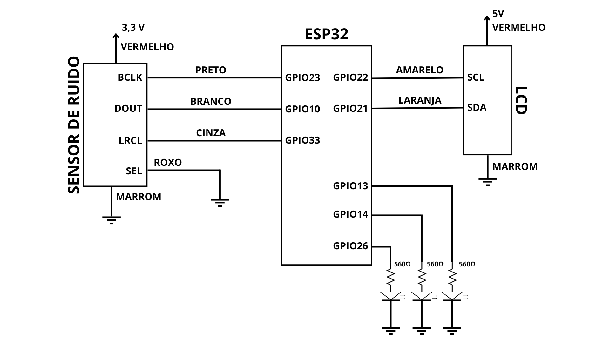

# SensorSonoro

# Projeto Sonômetro com ESP32 e Sensor SPH0645

Este projeto consiste em um sonômetro (medidor de nível de ruído) utilizando um ESP32, um sensor de áudio SPH0645 e um display LCD I2C. O dispositivo mede o nível de ruído em decibéis (dB) e exibe os resultados no LCD, além de enviar os dados para a plataforma ThingSpeak para monitoramento remoto. O projeto inclui hardware, software e modelagem 3D para as peças impressas em 3D.

## Descrição do Projeto

### Hardware

O hardware do projeto consiste em:

- **ESP32**: Microcontrolador responsável pelo processamento dos dados.
- **Sensor SPH0645**: Sensor de áudio que captura o som e converte para sinais elétricos.
- **Display LCD I2C**: Exibe o nível de ruído em tempo real.
- **LEDs**: Indicadores visuais para diferentes faixas de nível de ruído.
- **Resistores de 560Ω**: Utilizados para limitar a corrente nos LEDs.

  

### Software

O software foi desenvolvido na IDE do Arduino e inclui as biblotecas:

- ThingSpeak
- LiquidCrystal_I2C

### Modelagem 3D

Disponivel em
[Modelo3D](/Modelo_3D)

## Requisitos

- IDE do Arduino.
- Biblioteca LiquidCrystal_I2C.
- Biblioteca WiFi.
- Biblioteca ThingSpeak.
- Impressora 3D para as peças personalizadas.

## Contribuições

Contribuições são bem-vindas! Sinta-se à vontade para abrir issues ou pull requests.

## Agradecimentos

Agradecemos a todos que contribuíram para o desenvolvimento deste projeto.
